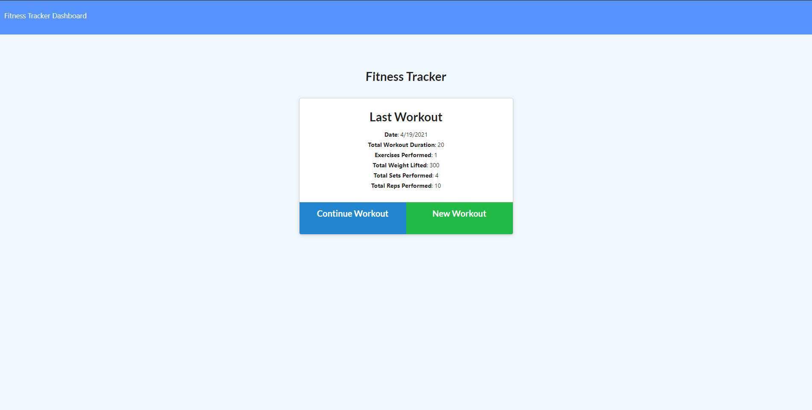
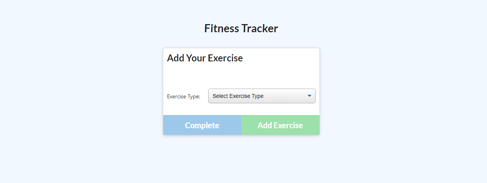
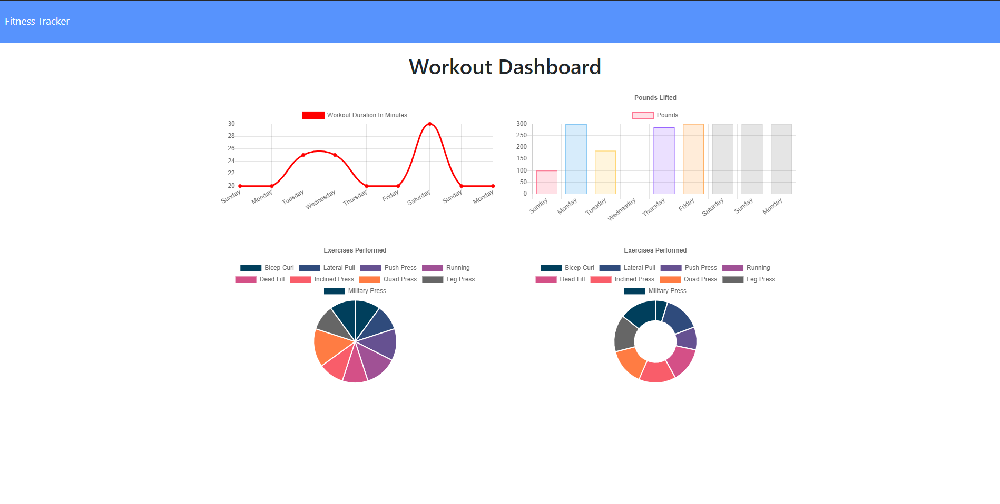

# 17-workout-tracker

## Table of Contents

* [Description](#description)
* [Usage](#usage)
* [Credit](#credit)
* [Questions](#questions)

## Description

Workout tracker allows you to keep track of and quantify your weekly workout routine. It utilizes MongoDB and CRUD operations to create workouts and identify how long they took, how many reps there were, and how much weight was used. This information then gets displayed a line graph and a bar graph.

```
As a user, I want to be able to view create and track daily workouts. I want to be able to log multiple exercises in a workout on a given day. I should also be able to track the name, type, weight, sets, reps, and duration of exercise. If the exercise is a cardio exercise, I should be able to track my distance traveled.
```

## Usage

To access the repo, go to https://github.com/ngkent75/17-workout-tracker

To access the deployed webapp, go to https://safe-waters-56611.herokuapp.com/?id=60806cd888a7550278705741



1. The homepage allows you to continue a workout, add a workout, or see your fitness dashboard.

2. Click continue or add workout and fill out the prompted information.



3. Click on dashboard to see a visualization of your workout routine over time. The graphs will update as you insert data.




## Credit

Markdown documentation: https://guides.github.com/features/mastering-markdown/#syntax

express: https://www.npmjs.com/package/express

mongoose: https://www.npmjs.com/package/mongoose

morgan: https://www.npmjs.com/package/morgan

nodemon: https://www.npmjs.com/package/nodemon


## Questions
Have any questions? Feel free to reach out.

GitHub: [ngkent75](https://github.com/ngkent75)

Email: [ngkent75@gmail.com](mailto:ngkent75@gmail.com)